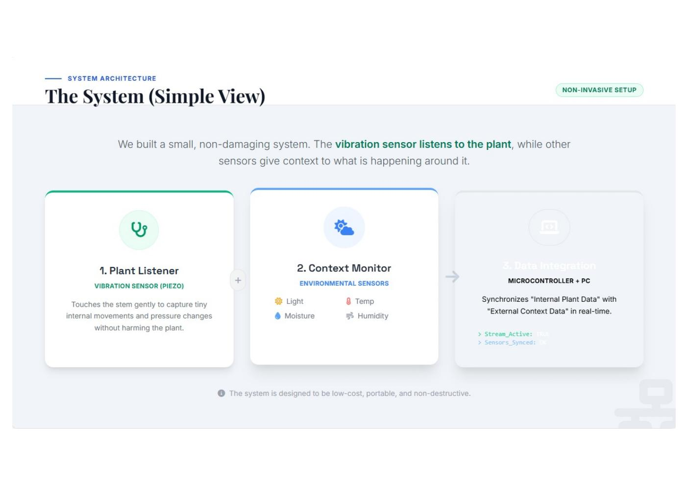
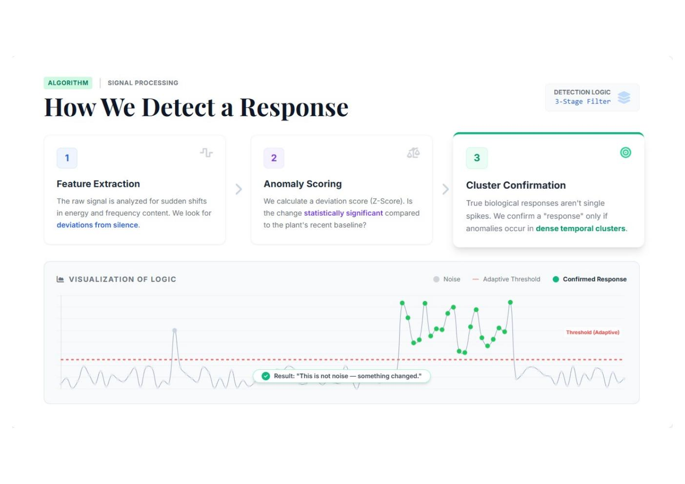
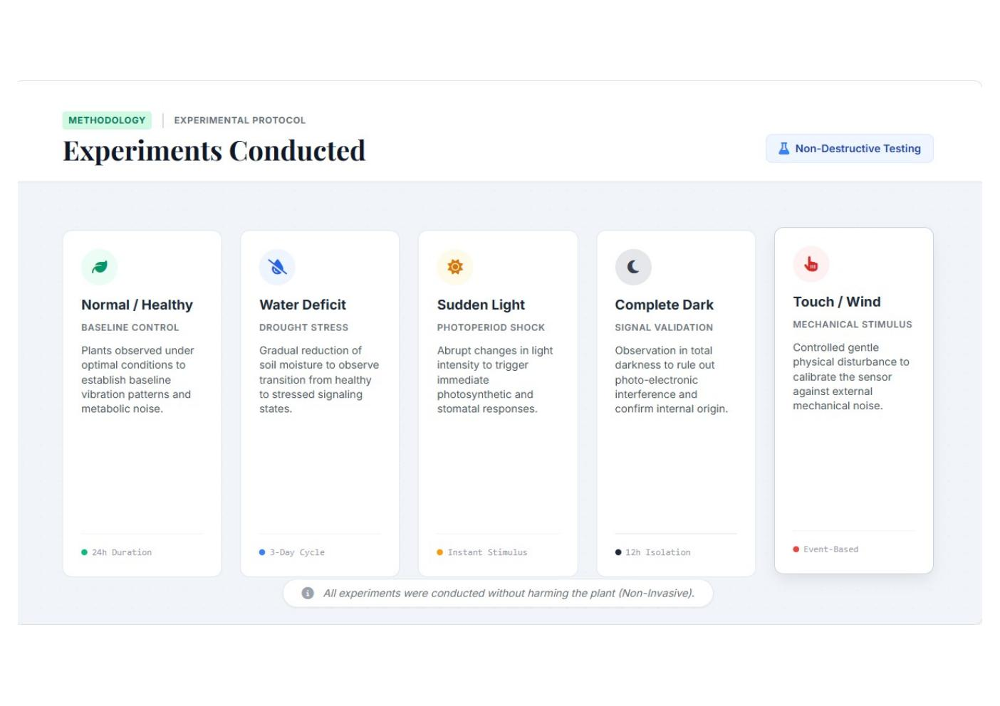
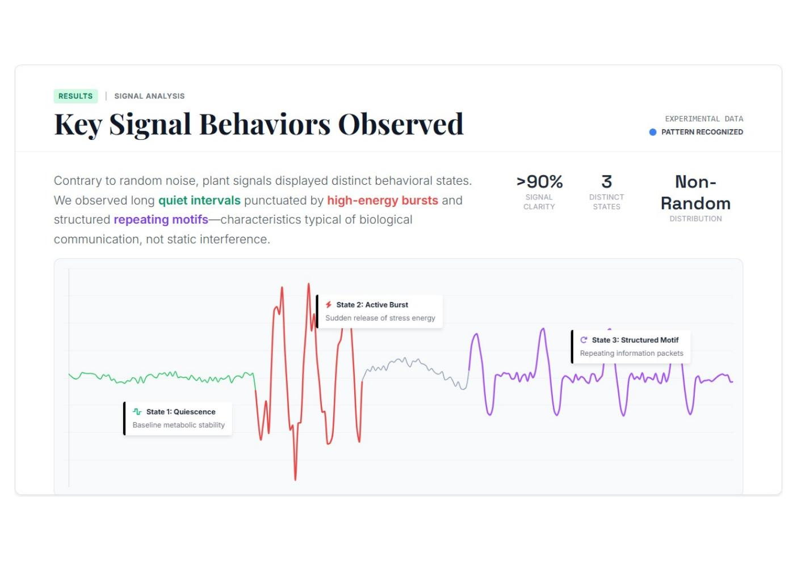
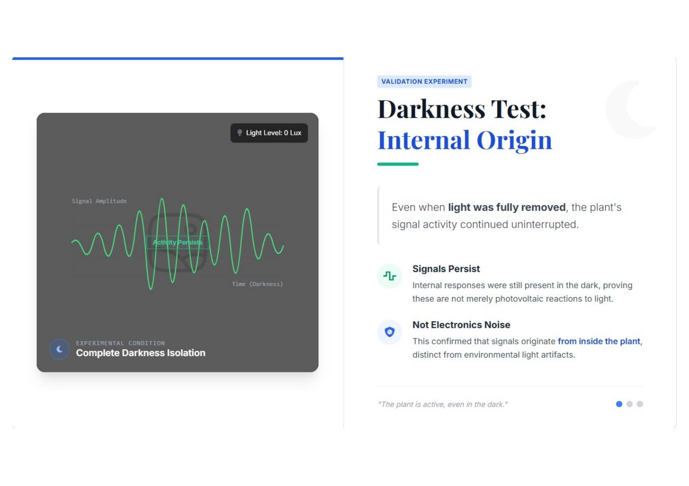

<div align="center">


# SPANDANA

### *Can a plant tell you it's thirsty?*

A real-time, non-invasive system for detecting plant stress — built on an Arduino Uno, a piezo disc, and a few rupees of sensors.

**🏆 Top 30 of 3,300+ entries — Young Innovator Programme (YIP) 2025–26**
**📍 Round 2 Finalist, IIT Kharagpur, March 2026**

</div>

---

## The idea in one paragraph

By the time a plant visibly wilts, it has already been stressed for hours or days. SPANDANA tries to access the *hidden window* between the stimulus and the visible symptom — by gently taping a piezoelectric sensor to a plant's stem and listening for the micro-vibrations and pressure shifts that happen when the plant reacts internally to water loss, temperature change, or sudden light. Environmental sensors (soil moisture, temperature, humidity, light) run in parallel to give context. An adaptive baseline algorithm decides what *normal* looks like for that plant in that moment, and flags everything that statistically deviates from it.

---

## What's inside this repo

```
spandana/
├── firmware/
│   └── spandana_uno.ino          # Arduino Uno sketch — sensor read + serial stream
├── host/
│   ├── spandana_listener.py      # Python listener — adaptive baseline + classifier + live plots
│   └── requirements.txt
├── docs/
│   └── SPANDANA_YIP_Round2_Deck.pdf   # Full presentation deck from IIT KGP
├── assets/                       # Slide exports used in this README
├── LICENSE
└── README.md
```

---

## The system (simple view)



Three components: a **plant listener** (the piezo on the stem), a **context monitor** (soil, temperature, humidity, light), and a **microcontroller + PC** that synchronises the internal plant signal with the external environment in real time.

---

## Hardware

| Component                | Role                          | Notes                                |
|--------------------------|-------------------------------|--------------------------------------|
| Arduino Uno              | Microcontroller               | Any 5V Uno-compatible works          |
| Piezo disc               | Stem vibration sensor         | Taped to base of stem                |
| DHT11                    | Temperature + humidity        | Digital pin 2                        |
| Soil moisture probe      | Root-zone water level         | Analog A1                            |
| LDR                      | Ambient light                 | Analog A2                            |

The piezo is attached at the **base of the stem** with light medical tape — no glue, no piercing, no tissue damage. Total hardware cost: under ₹500.

### Wiring

```
Piezo (+)         → A0          (1MΩ pulldown to GND recommended)
Soil moisture     → A1
LDR               → A2          (10kΩ pulldown)
DHT11 data        → D2
```

---

## How detection works



A three-stage filter:

1. **Feature extraction** — sudden shifts in signal energy versus the recent quiet baseline
2. **Anomaly scoring** — every sample compared statistically (Z-score) against the plant's recent self
3. **Cluster confirmation** — single spikes get rejected; only dense temporal clusters of anomalies are confirmed as a true response

### The adaptive baseline

Plants don't have one "normal" — they drift through the day. A static threshold like "anything above 50" would fire constantly at noon and miss everything at night. So instead, the host listener maintains an exponential moving average of the piezo signal as a slowly-updating reference, and the threshold itself is dynamic: `3 × std_dev` of recent deviations, recomputed on a sliding window. The plant becomes its own benchmark.

A 0.4-second cooldown after each event prevents one real disturbance from registering as fifty echoing ones.

### Classification

When an event fires, the system inspects the context sensors at that moment:

- Soil moisture > 500 → `Chronic Dehydration Stress`
- Soil moisture dropped sharply → `Rehydration Response`
- Temperature jumped > 2°C → `Thermal Stress`
- Light changed by > 120 units → `Light Shock Stress`
- Otherwise → `Mechanical / Unknown Stress`

This is deliberately threshold-based and not ML — see *Limitations* below.

---

## Experiments conducted



Five non-destructive protocols, all on Balsam, in a school-lab environment:

1. **Normal / Healthy** — 24-hour baseline
2. **Water Deficit** — 3-day gradual soil dry-down
3. **Sudden Light** — instant photoperiod change
4. **Complete Dark** — 12-hour total isolation (signal-validation control)
5. **Touch / Wind** — controlled mechanical stimulus

---

## What the data showed



Three behavioural states emerged across the recordings — and they did not look like random noise:

- **Quiescence** — long, low-amplitude baseline periods
- **Active bursts** — sudden high-amplitude releases shortly after a stimulus
- **Structured repeating motifs** — sustained, patterned activity during prolonged stress

### The water deprivation result


Over a 48-hour drought run, the signal didn't spike-and-fade. It produced **persistent repeating patterns at over 150 events per hour**, suggesting ongoing internal physiological adjustment rather than a one-off acute reaction.

### The darkness validation



The darkness test was the result that mattered most for ruling out the most embarrassing failure mode: was the piezo just reacting to ambient light leaking onto its surface?

When the plant was sealed in total dark for 12 hours, **signal activity continued uninterrupted**. Whatever was driving the readings was coming from the plant body, not from photons hitting the sensor.

---

## Core findings


- Plants produce distinct, **measurable physical signals** when environmental conditions change
- These signals appear **before** visible symptoms like wilting or yellowing
- The hidden phase between stimulus and symptom is where SPANDANA does its work

---

## What this project is *not*

Being clear about scope is more useful than overclaiming:

- It does **not** diagnose specific conditions
- It does **not** explain the cellular biology causing the vibrations
- It does **not** predict whether a plant will survive or recover
- It does **not** translate plant "language" — there's no language being claimed

It's a listening system. It detects that something changed. That's it.

---

## Limitations & why this is currently paused

Honest version: a piezo disc on a stem is a blunt instrument.

**Bandwidth.** A standard piezo disc taped to a stem is fine for low-frequency mechanical movement, but the literature on plant ultrasonic emission talks about clicks in the **20–100 kHz** range. An Arduino Uno's analog read rate tops out around **9.6 kHz**. To verify whether ultrasonic clicks are actually being captured — versus aliased noise — would need a proper ultrasonic transducer and a much faster ADC. **The Uno cannot sample fast enough.**

**Classification.** Five hand-written if-statements is not a classifier in any serious sense. Separating drought stress from thermal stress from "the table got bumped" requires labelled multi-species data and ML — which a single school-lab setup over a few weeks can't produce.

**Generalisation.** Tested on Balsam. Monocots, woody stems, succulents — all unknowns.

The lesson learned was specific and worth writing down:

> **Hardware limits matter more than software cleverness.** Better algorithms on top of a sensor that can't see what you want it to see won't help.

---

## If this project is revived

- Replace piezo with a proper ultrasonic transducer (40 kHz+) and a faster MCU (ESP32 or Teensy)
- Replace the 5 fixed rules with an ML classifier trained on labelled stimulus data
- Multi-species testing — monocots vs dicots, woody vs herbaceous
- Sealed climate chamber to remove environmental confounds

---

## Running it yourself

### Arduino side

1. Open `firmware/spandana_uno.ino` in the Arduino IDE
2. Install Adafruit's `DHT sensor library`
3. Upload to an Uno

### Host side

```bash
cd host
pip install -r requirements.txt
python spandana_listener.py
```

Edit the `PORT` variable at the top of the Python file to match your system:
- Windows: `COM3`, `COM4`, ...
- Linux: `/dev/ttyUSB0` or `/dev/ttyACM0`
- macOS: `/dev/cu.usbmodem*`

---

## Credits

**Ric Kanjilal** — Grade 10, Don Bosco School, Liluah
Concept, hardware, firmware, signal processing pipeline, experiments.

With thanks to **Riddhi Dhar** for the project visualisation and presentation design.

Presented at the **Young Innovator Programme (YIP) Round 2, IIT Kharagpur — March 2026.**

📄 The full presentation deck is in [`docs/SPANDANA_YIP_Round2_Deck.pdf`](docs/SPANDANA_YIP_Round2_Deck.pdf).

---

## License

[MIT](LICENSE). Use it, learn from it, improve it.
